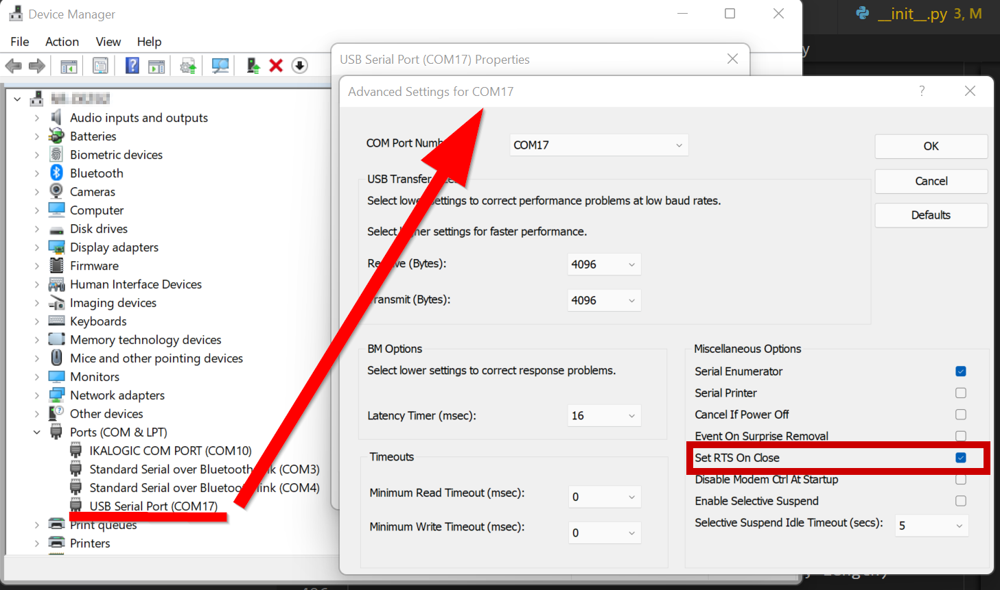

Mancsmoso Light
---------------
# Build

```
cmake -DCMAKE_SYSTEM_PROCESSOR=msp430f1132 -DCMAKE_TOOLCHAIN_FILE=cmake/gcc-msp430.cmake -DCMAKE_EXPORT_COMPILE_COMMANDS=TRUE -DCMAKE_BUILD_TYPE=Debug -DCMAKE_C_COMPILER=C:/Tools/gcc-msp430/bin/msp430-elf-gcc.exe -DCMAKE_CXX_COMPILER=C:/Tools/gcc-msp430/bin/msp430-elf-gcc.exe -Sc:/Work/MancsMosoLight -Bc:/Work/build/MancsMosoLight-msp430-gcc-Debug -G Ninja
cmake --build c:/Work/build/MancsMosoLight-msp430-gcc-Debug --config Debug --target all
```

# Flashing the MCU

For flashing, a 3.3V USB-UART converter is needed.

## BSLDEMO.EXE

```
cd "C:\ti\BSL-Scripter\DEPRECATED\BSLDEMO"
.\BSLDEMO.exe -tUSB serial -cCOM17 -aPATCH.TXT -pint_vect.txt
```

## msp430-bsl.exe

- with python 3: git@github.com:zolinux/python-msp430-tools.git
    ```
    py -m msp430.bsl  --invert-reset  -p COM17   -v -e -P c:\work\build\MancsMosoLight-msp430-gcc-Debug\mml.elf
    ```
  
## USB-UART

To use a USB-UART adapter with `#DTR` controlling the `TEST` pin, the idle state of the `TEST` pin needs to be low, otherwise the JTAG pins will overwrite the GPIO functionality. This may be configured by enabling the **Set RTS on close** in the COM port advanced settings:


